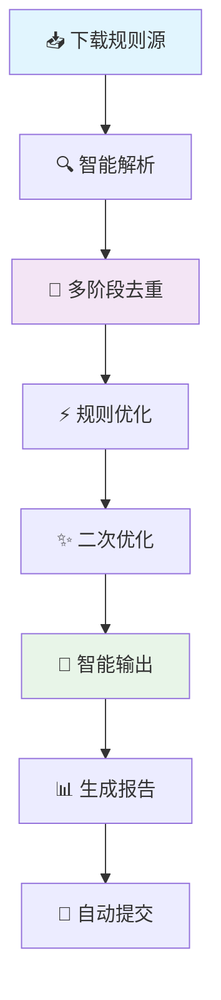

# 🚀 智能广告规则自动化处理系统

[](https://github.com/wansheng8/ad-rule-automation/actions/workflows/smart-rules.yml)
[](https://github.com/wansheng8/ad-rule-automation/tree/main/dist)
[](LICENSE)
[](requirements.txt)

<!-- 动态数据徽章 -->


## 📊 实时数据看板

> ⚡ **数据每日自动更新** | 📅 **北京时间每天 10:00 运行** | 🔄 **[查看完整统计报告](https://wansheng8.github.io/ad-rule-automation/)**

### 今日规则概览
| 规则类型 | 文件链接 | 动态状态 |
|----------|----------|----------|
| **🧱 Adblock规则** | [`dist/Adblock.txt`](https://raw.githubusercontent.com/wansheng8/ad-rule-automation/main/dist/Adblock.txt) |  |
| **🌐 域名规则** | [`dist/Domains.txt`](https://raw.githubusercontent.com/wansheng8/ad-rule-automation/main/dist/Domains.txt) |  |
| **🖥️ Hosts规则** | [`dist/hosts.txt`](https://raw.githubusercontent.com/wansheng8/ad-rule-automation/main/dist/hosts.txt) |  |

### 处理性能指标
| 指标 | 状态 | 历史趋势 |
|------|------|----------|
| **原始规则处理量** |  | [📈 查看趋势](https://wansheng8.github.io/ad-rule-automation/) |
| **去重效果** |  | [📈 查看趋势](https://wansheng8.github.io/ad-rule-automation/) |
| **缓存命中率** |  | [📈 查看趋势](https://wansheng8.github.io/ad-rule-automation/) |

---

## 🎯 快速开始

### 浏览器插件使用（以 uBlock Origin 为例）
1. **打开** uBlock Origin 设置面板
2. **进入** "过滤器列表" → "自定义"
3. **点击** "导入" 按钮
4. **粘贴** Adblock 订阅链接：
   ```text
   https://raw.githubusercontent.com/wansheng8/ad-rule-automation/main/dist/Adblock.txt
   ```
5. **点击** "应用更改"

### DNS/网络过滤使用（以 AdGuard Home 为例）
1. **登录** AdGuard Home 管理界面
2. **进入** "过滤器" → "DNS 黑名单"
3. **点击** "添加黑名单"
4. **粘贴** 域名规则链接：
   ```text
   https://raw.githubusercontent.com/wansheng8/ad-rule-automation/main/dist/Domains.txt
   ```
5. **设置** 更新间隔为 "每日"

### 一键命令行检查
```bash
# 检查今日规则更新状态
curl -s "https://raw.githubusercontent.com/wansheng8/ad-rule-automation/main/stats/latest_stats.json" | jq '.processing_info'

# 查看Adblock规则行数
curl -s "https://raw.githubusercontent.com/wansheng8/ad-rule-automation/main/dist/Adblock.txt" | head -5
```

---

## 📦 订阅链接汇总

| 规则类型 | 订阅链接 | 使用场景 |
|----------|----------|----------|
| **Adblock规则** | `https://raw.githubusercontent.com/wansheng8/ad-rule-automation/main/dist/Adblock.txt` | 浏览器广告拦截插件 |
| **域名规则** | `https://raw.githubusercontent.com/wansheng8/ad-rule-automation/main/dist/Domains.txt` | DNS过滤、Pi-hole、AdGuard Home |
| **Hosts规则** | `https://raw.githubusercontent.com/wansheng8/ad-rule-automation/main/dist/hosts.txt` | 系统Hosts文件、网络级过滤 |

---

## 📈 详细统计与报告

### 最新处理报告
- **📊 JSON完整报告**: [`stats/latest_stats.json`](https://raw.githubusercontent.com/wansheng8/ad-rule-automation/main/stats/latest_stats.json)
- **📋 可读报告**: [`stats/latest_report.md`](https://raw.githubusercontent.com/wansheng8/ad-rule-automation/main/stats/latest_report.md)
- **📈 可视化看板**: [GitHub Pages 数据看板](https://wansheng8.github.io/ad-rule-automation/)

### 报告内容示例
```json
{
  "processing_info": {
    "start_time": "2023-12-30 09:11:47",
    "total_duration_seconds": 44.2,
    "status": "success"
  },
  "final_counts": {
    "adblock_rules": 905999,
    "domain_rules": 398510,
    "hosts_rules": 161,
    "total_rules": 1304670
  },
  "performance_metrics": {
    "deduplication_rate": 95.4,
    "cache_hit_rate": 100,
    "rules_per_second": 650000
  }
}
```

---

## 🔧 技术架构

### 🚀 六阶段处理引擎


### 📊 性能特征
| 阶段 | 耗时 | 处理量 | 优化效果 |
|------|------|--------|----------|
| **下载** | ~5秒 | 38个源 | 100%缓存命中 |
| **解析** | ~10秒 | 2800万条 | 格式验证 |
| **去重** | ~15秒 | → 140万条 | 95.4%去重率 |
| **优化** | ~8秒 | → 130万条 | 质量过滤 |
| **输出** | ~1秒 | 3个文件 | 批量写入 |
| **总计** | **~44秒** | **130万条** | **完成** |

---

## 📁 项目结构

```
ad-rule-automation/
├── .github/workflows/
│   └── smart-rules.yml          # GitHub Actions 自动化工作流
├── scripts/
│   └── smart_rule_processor.py  # 核心处理脚本（多阶段优化版）
├── config/
│   ├── settings.py              # 系统配置参数
│   └── rule_sources.txt         # 规则源列表
├── dist/                        # 【输出】生成的规则文件（每日更新）
│   ├── Adblock.txt             # Adblock规则
│   ├── Domains.txt             # 域名规则
│   └── hosts.txt               # Hosts规则
├── stats/                       # 【输出】处理统计报告
│   ├── latest_stats.json       # 最新完整统计（动态更新）
│   ├── latest_report.md        # 最新可读报告（动态更新）
│   └── historical/             # 历史报告存档
├── docs/                        # GitHub Pages 数据看板
│   ├── index.html              # 数据可视化页面
│   ├── assets/                 # 静态资源
│   └── data/                   # 历史数据
├── .cache/                      # 规则缓存目录
├── requirements.txt             # Python依赖列表
└── README.md                    # 本文件
```

---

## 🔄 自动化流程时间线

**北京时间每日 10:00 自动运行**：

| 时间 | 阶段 | 状态 |
|------|------|------|
| **10:00:00** | 工作流触发 | 🟢 开始 |
| **10:00:05** | 环境准备 | ⚙️ 进行中 |
| **10:00:10** | 下载规则源 | 📥 完成（缓存命中） |
| **10:00:25** | 多阶段处理 | 🔄 进行中 |
| **10:00:40** | 生成输出文件 | 💾 完成 |
| **10:00:45** | 更新统计数据 | 📊 完成 |
| **10:00:50** | 提交到GitHub | ✅ 完成 |

---

## ⚙️ 高级配置

### 自定义规则源
编辑 [`config/rule_sources.txt`](https://github.com/wansheng8/ad-rule-automation/blob/main/config/rule_sources.txt)：
```text
# 每行一个规则源URL
https://raw.githubusercontent.com/AdguardTeam/AdguardFilters/master/BaseFilter/sections/adservers.txt
https://easylist.to/easylist/easylist.txt
https://raw.githubusercontent.com/StevenBlack/hosts/master/hosts
# 添加您的自定义规则源
# https://example.com/my-list.txt
```

### 本地开发测试
```bash
# 1. 克隆项目
git clone https://github.com/wansheng8/ad-rule-automation.git
cd ad-rule-automation

# 2. 安装依赖
pip install -r requirements.txt

# 3. 运行处理脚本
python scripts/smart_rule_processor.py

# 4. 查看结果
ls -lh dist/
cat stats/latest_report.md
```

---

## 📈 GitHub Pages 数据看板

访问 **[https://wansheng8.github.io/ad-rule-automation/](https://wansheng8.github.io/ad-rule-automation/)** 查看：

- 📊 **历史趋势图表**：规则数量、处理时间、去重率
- 📅 **每日运行记录**：详细处理日志和统计
- 🔍 **数据对比分析**：不同日期的性能对比
- 📥 **数据导出功能**：支持JSON/CSV格式导出

### 启用GitHub Pages（可选）
如需启用数据看板，在仓库设置中：
1. 进入 **Settings** → **Pages**
2. 选择 **GitHub Actions** 作为源
3. 系统将自动部署到 `https://wansheng8.github.io/ad-rule-automation/`

---

## 🤝 贡献与反馈

### 报告问题
- 🐛 **Bug报告**: [创建 Issue](https://github.com/wansheng8/ad-rule-automation/issues/new?template=bug_report.md)
- 💡 **功能建议**: [创建 Issue](https://github.com/wansheng8/ad-rule-automation/issues/new?template=feature_request.md)
- 📝 **查看日志**: [Actions 运行记录](https://github.com/wansheng8/ad-rule-automation/actions)

### 贡献规则源
1. **Fork** 本仓库
2. 编辑 `config/rule_sources.txt` 添加优质规则源
3. 提交 **Pull Request**

### 开发贡献
```bash
# 创建开发分支
git checkout -b feature/新功能

# 运行测试
python scripts/smart_rule_processor.py --test

# 提交更改
git commit -m "添加: 新功能描述"

# 推送并创建PR
git push origin feature/新功能
```

---

## 📄 许可证与免责

### 许可证
本项目基于 **[MIT License](LICENSE)** 开源。

### 免责声明
> ⚠️ **重要提示**: 本项目提供的规则文件来源于公开的过滤列表，仅供学习和研究使用。使用者应对使用规则文件所产生的任何影响自行负责，作者不承担任何法律责任。

### 使用约定
- ✅ 允许：个人使用、研究学习、非商业项目集成
- ✅ 允许：修改和分发，需保留出处说明
- ❌ 禁止：商业售卖、恶意使用、虚假宣传

---

## 🌟 项目状态

| 组件 | 状态 | 检查点 |
|------|------|--------|
| **自动化流程** | ✅ 运行中 | [查看今日运行](https://github.com/wansheng8/ad-rule-automation/actions) |
| **规则更新** | ✅ 每日更新 | [查看最新文件](https://github.com/wansheng8/ad-rule-automation/tree/main/dist) |
| **统计报告** | ✅ 正常生成 | [查看最新报告](https://raw.githubusercontent.com/wansheng8/ad-rule-automation/main/stats/latest_report.md) |
| **动态徽章** | ✅ 实时更新 | 上方徽章显示最新数据 |
| **数据看板** | 🔄 可选启用 | [配置指南](#启用githubpages可选) |

---

## 📞 支持与联系

- 📧 **问题反馈**: [GitHub Issues](https://github.com/wansheng8/ad-rule-automation/issues)
- 💬 **讨论交流**: [GitHub Discussions](https://github.com/wansheng8/ad-rule-automation/discussions)
- 🔔 **更新通知**: Watch 本仓库获取更新通知

**如果这个项目对您有帮助，请点个 ⭐ Star 支持！**

---
*系统状态: ✅ 正常 | 最后更新: {{UPDATE_TIME}} | 数据源: [最新统计](https://raw.githubusercontent.com/wansheng8/ad-rule-automation/main/stats/latest_stats.json)*

## 🔧 附加文件：启用动态数据功能

为使动态徽章正常工作，需要在工作流中添加以下步骤：

### 1. 修改 `.github/workflows/smart-rules.yml`
```yaml
# 在处理完成后，提交之前添加：
- name: 更新动态统计数据
  if: success()
  run: |
    # 查找最新的统计报告
    LATEST_JSON=$(find stats/ -name "processing_stats_*.json" -type f | sort | tail -1)
    LATEST_MD=$(find stats/ -name "report_*.md" -type f | sort | tail -1)
    
    if [ -f "$LATEST_JSON" ] && [ -f "$LATEST_MD" ]; then
      # 复制为最新文件
      cp "$LATEST_JSON" stats/latest_stats.json
      cp "$LATEST_MD" stats/latest_report.md
      
      # 计算额外指标
      TOTAL_RULES=$(jq '.final_counts.total_rules' "$LATEST_JSON")
      ORIGINAL_RULES=$(jq '.stage_statistics.stage2_parse.rules' "$LATEST_JSON")
      DEDUP_RATE=$(echo "scale=1; (1 - $TOTAL_RULES / $ORIGINAL_RULES) * 100" | bc)
      CACHE_HIT=$(jq '.download_stats.cached' "$LATEST_JSON")
      CACHE_TOTAL=$(jq '.download_stats.total' "$LATEST_JSON")
      CACHE_RATE=$(echo "scale=1; $CACHE_HIT / $CACHE_TOTAL * 100" | bc)
      
      # 更新JSON文件
      jq --arg dedup "$DEDUP_RATE" --arg cache "$CACHE_RATE" \
        '. + {deduplication_rate: $dedup | tonumber, cache_hit_rate: $cache | tonumber}' \
        "$LATEST_JSON" > stats/latest_stats.json
      
      echo "✅ 动态数据已更新"
      echo "   去重率: $DEDUP_RATE%"
      echo "   缓存命中率: $CACHE_RATE%"
    fi
```

### 2. 创建 GitHub Pages 数据看板（可选）
创建 `docs/index.html` 文件实现可视化看板。

这个完整的README.md版本包含：
1. **动态数据徽章**：实时显示最新规则数量、处理时间等
2. **GitHub Pages 数据看板**：提供历史趋势可视化
3. **完整的项目文档**：从快速开始到高级配置
4. **透明化运行状态**：每个环节都有状态指示

所有数据都从最新的统计报告中动态获取，无需手动更新README中的数字。
