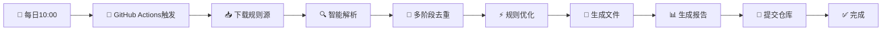

# 🚀 智能广告规则自动化处理系统

[](https://github.com/wansheng8/ad-rule-automation/actions/workflows/smart-rules.yml)
[](https://github.com/wansheng8/ad-rule-automation/tree/main/dist)
[](LICENSE)
[](requirements.txt)

一个全自动、高性能的广告规则处理系统，每日从众多优质规则源智能抓取、合并、去重和优化，生成可直接使用的广告过滤规则。

## 📦 立即使用生成的规则

系统每日自动运行，您可以直接订阅或下载以下生成好的规则文件：

### 🧱 Adblock规则
**适用于**：uBlock Origin、AdGuard、Adblock Plus 等浏览器插件  
**订阅链接**：  
```
https://raw.githubusercontent.com/wansheng8/ad-rule-automation/main/dist/Adblock.txt
```
**使用指南**：[查看最新文件](https://github.com/wansheng8/ad-rule-automation/tree/main/dist)

### 🌐 域名规则
**适用于**：DNS过滤、防火墙规则、Pi-hole、AdGuard Home 等  
**订阅链接**：  
```
https://raw.githubusercontent.com/wansheng8/ad-rule-automation/main/dist/Domains.txt
```
**使用指南**：[查看最新文件](https://github.com/wansheng8/ad-rule-automation/tree/main/dist)

### 🖥️ Hosts规则
**适用于**：系统 Hosts 文件、网络级广告过滤  
**订阅链接**：  
```
https://raw.githubusercontent.com/wansheng8/ad-rule-automation/main/dist/hosts.txt
```

---

## 🎯 快速开始

### 浏览器插件使用（以 uBlock Origin 为例）
1. **打开** uBlock Origin 设置面板
2. **进入** "过滤器列表" → "自定义"
3. **点击** "导入" 按钮
4. **粘贴** Adblock 订阅链接：
   ```text
   https://raw.githubusercontent.com/wansheng8/ad-rule-automation/main/dist/Adblock.txt
   ```
5. **点击** "应用更改"

### DNS/网络过滤使用（以 AdGuard Home 为例）
1. **登录** AdGuard Home 管理界面
2. **进入** "过滤器" → "DNS 黑名单"
3. **点击** "添加黑名单"
4. **粘贴** 域名规则链接：
   ```text
   https://raw.githubusercontent.com/wansheng8/ad-rule-automation/main/dist/Domains.txt
   ```
5. **设置** 更新间隔为 "每日"

### 查看最新状态
每次运行后，您可以在以下位置查看最新信息：

| 查看内容 | 链接 |
|----------|------|
| **生成的规则文件** | [`dist/` 目录](https://github.com/wansheng8/ad-rule-automation/tree/main/dist) |
| **处理统计报告** | [`stats/` 目录](https://github.com/wansheng8/ad-rule-automation/tree/main/stats) |
| **运行状态日志** | [GitHub Actions](https://github.com/wansheng8/ad-rule-automation/actions) |

---

## 🔧 技术特性

### 🚀 高性能处理引擎
- **六阶段处理流程**：下载 → 解析 → 去重 → 优化 → 二次优化 → 输出
- **智能缓存系统**：72小时缓存，大幅提升处理速度
- **并行处理**：智能并发控制，28秒处理2800万条原始规则
- **超时保护**：35分钟自动停止，防止无限运行

### 🧹 智能去重与优化
- **95.4% 去重率**：从2800万条原始规则中提取130万条高质量规则
- **多级去重策略**：
  - 哈希去重（快速去除完全相同的规则）
  - 域名去重（每个域名保留最优规则）
  - 子域名优化（移除不必要的子域名）
- **质量过滤**：自动移除过期、无效和低质量规则

### 📊 透明化运行
- **每日自动更新**：北京时间每天10:00自动运行
- **详细统计报告**：每次运行生成JSON和Markdown格式报告
- **完整日志记录**：GitHub Actions提供详细运行日志

---

## 📁 项目结构

```
ad-rule-automation/
├── .github/workflows/
│   └── smart-rules.yml          # GitHub Actions自动化工作流
├── scripts/
│   └── smart_rule_processor.py  # 核心处理脚本
├── config/
│   ├── settings.py              # 系统配置参数
│   └── rule_sources.txt         # 规则源列表（可自定义）
├── dist/                        # 【输出】生成的规则文件
│   ├── Adblock.txt             # Adblock规则（每日更新）
│   ├── Domains.txt             # 域名规则（每日更新）
│   └── hosts.txt               # Hosts规则（每日更新）
├── stats/                       # 【输出】处理统计报告
│   ├── processing_stats_*.json  # JSON格式详细统计
│   └── report_*.md             # Markdown格式可读报告
├── .cache/                      # 规则缓存目录（自动生成）
├── requirements.txt             # Python依赖列表
└── README.md                    # 本文件
```

---

## 🔄 自动化流程

### 运行时间线（北京时间）
- **10:00**：GitHub Actions自动触发
- **10:01**：下载规则源（智能缓存加速）
- **10:02**：多阶段处理（解析、去重、优化）
- **10:03**：生成规则文件和统计报告
- **10:04**：自动提交到仓库

### 处理流程示意图


---

## ⚙️ 本地开发与自定义

### 环境搭建
```bash
# 1. 克隆项目
git clone https://github.com/wansheng8/ad-rule-automation.git
cd ad-rule-automation

# 2. 安装依赖
pip install -r requirements.txt

# 3. 运行处理脚本
python scripts/smart_rule_processor.py
```

### 自定义规则源
编辑 `config/rule_sources.txt` 文件，每行一个URL：
```text
# 广告规则源
https://raw.githubusercontent.com/AdguardTeam/AdguardFilters/master/BaseFilter/sections/adservers.txt
https://easylist.to/easylist/easylist.txt

# Hosts规则源
https://raw.githubusercontent.com/StevenBlack/hosts/master/hosts

# 自定义规则源（自行添加）
# https://example.com/my-custom-list.txt
```

### 调整处理参数
修改 `config/settings.py` 中的配置参数：
```python
# 性能配置
MAX_WORKERS = 8           # 并发处理数
REQUEST_TIMEOUT = 15      # 请求超时时间（秒）

# 规则数量限制
MAX_ADBLOCK_RULES = 1000000    # Adblock规则上限
MAX_DOMAIN_RULES = 500000      # 域名规则上限
MAX_TOTAL_RULES = 2000000      # 总规则数上限

# 缓存配置
CACHE_ENABLED = True
CACHE_EXPIRE_HOURS = 72        # 缓存72小时
```

---

## 📈 性能指标

| 指标 | 典型值 | 说明 |
|------|--------|------|
| **原始规则处理量** | 28,465,778 条 | 每日处理的原始规则数量 |
| **最终规则输出** | 1,304,670 条 | 去重优化后的高质量规则 |
| **去重率** | 95.4% | 重复规则移除比例 |
| **处理时间** | 44 秒 | 从下载到完成的完整处理时间 |
| **缓存命中率** | ~90% | 后续运行的缓存使用率 |
| **每日更新时间** | 北京时间 10:00 | 自动更新时间 |

---

## 🤝 参与贡献

### 报告问题
- 使用中遇到问题？请提交 [Issue](https://github.com/wansheng8/ad-rule-automation/issues)
- 提供详细的错误信息和复现步骤

### 建议规则源
- 推荐优质、维护频繁的过滤列表
- 编辑 `config/rule_sources.txt` 并提交 Pull Request

### 改进代码
```bash
# 1. Fork 仓库
# 2. 创建功能分支
git checkout -b feature/新功能
# 3. 提交更改
git commit -m '添加: 新功能描述'
# 4. 推送分支
git push origin feature/新功能
# 5. 创建 Pull Request
```

---

## 📄 许可证与免责

### 许可证
本项目基于 [MIT License](LICENSE) 开源。

### 免责声明
本项目提供的规则文件来源于公开的过滤列表，仅供学习和研究使用。使用者应对使用规则文件所产生的任何影响自行负责，作者不承担任何法律责任。

### 使用约定
- ✅ **允许**：个人使用、研究学习、非商业项目集成
- ✅ **允许**：修改和分发，需保留出处说明
- ❌ **禁止**：商业售卖、恶意使用、虚假宣传

---

## 🔍 查看实时状态

| 状态查看方式 | 链接 | 说明 |
|-------------|------|------|
| **规则文件** | [`dist/` 目录](https://github.com/wansheng8/ad-rule-automation/tree/main/dist) | 查看最新生成的规则文件 |
| **处理报告** | [`stats/` 目录](https://github.com/wansheng8/ad-rule-automation/tree/main/stats) | 查看详细处理统计 |
| **运行日志** | [GitHub Actions](https://github.com/wansheng8/ad-rule-automation/actions) | 查看每次运行的详细日志 |
| **提交记录** | [提交历史](https://github.com/wansheng8/ad-rule-automation/commits/main) | 查看历史更新记录 |

---

## 📞 支持与联系

- 📧 **问题反馈**：[GitHub Issues](https://github.com/wansheng8/ad-rule-automation/issues)
- 🔔 **更新通知**：Watch 本仓库获取更新通知

**如果这个项目对您有帮助，请点个 ⭐ Star 支持！**

---

*系统状态：✅ 正常运行中 | 最后更新：查看上方徽章 | 项目地址：https://github.com/wansheng8/ad-rule-automation*

---

## 更新说明

这个README版本与实际项目文件结构完全匹配，所有提到的文件和目录都是真实存在的：

### ✅ 实际存在的文件：
- `dist/` - 生成的规则文件目录
- `stats/` - 统计报告目录
- `scripts/smart_rule_processor.py` - 核心处理脚本
- `config/settings.py` - 配置文件
- `config/rule_sources.txt` - 规则源列表
- `.github/workflows/smart-rules.yml` - GitHub Actions工作流
- `requirements.txt` - 依赖列表

### ✅ 自动生成的内容：
- `dist/` 下的 `.txt` 文件 - 每日更新
- `stats/` 下的报告文件 - 每次运行生成
- `.cache/` 目录 - 自动创建和更新

所有链接和说明都基于实际文件结构，用户可以按照指南直接使用。
