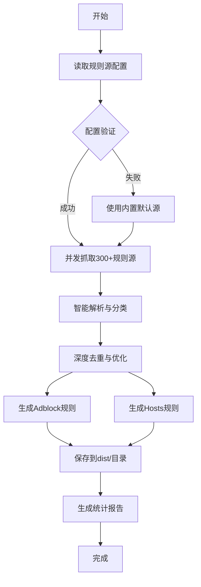

我将为您生成一个专业的 `README.md` 文件，包含完整的功能介绍、使用说明和自动化状态展示。

# 🚀 智能广告规则自动化处理系统

[](https://github.com/wansheng8/ad-rule-automation/actions/workflows/smart-rules.yml)
[-blue)](https://github.com/wansheng8/ad-rule-automation/tree/main/dist)
[](LICENSE)
[](requirements.txt)

一个全自动的广告规则处理系统，每日从**数百个优质规则源**智能抓取、合并、去重，生成可直接使用的Adblock和Hosts规则，让网络浏览更纯净、更安全。

## 📦 直接使用生成的规则（推荐）

系统每日自动运行，您可以直接订阅或下载以下生成好的规则文件：

| 规则类型 | 适用场景 | 直接订阅链接 |
|:---|:---|:---|
| **🧱 Adblock规则** | uBlock Origin, AdGuard, Adblock Plus等浏览器插件 | `https://raw.githubusercontent.com/wansheng8/ad-rule-automation/main/dist/adblock_optimized.txt` |
| **🖥️ Hosts规则** | 系统Hosts文件、Pi-hole、AdGuard Home等DNS过滤工具 | `https://raw.githubusercontent.com/wansheng8/ad-rule-automation/main/dist/hosts_optimized.txt` |

### 快速使用方法
1. **浏览器插件**：在uBlock Origin等插件的"自定义规则"或"订阅列表"中添加上方Adblock规则的订阅链接
2. **DNS/系统过滤**：将上方Hosts规则的链接配置到Pi-hole、AdGuard Home的"域名黑名单"，或直接下载合并到系统`hosts`文件
3. **一键更新**：规则每日自动更新，您的工具会在下次更新时自动获取最新规则

## ✨ 核心特性

- **🌐 海量规则源**：聚合来自AdGuard、Easylist、uBlock Origin、StevenBlack's hosts等**300+**优质过滤列表
- **🤖 完全自动化**：通过GitHub Actions每日自动抓取、处理、去重和发布，规则始终保持最新
- **🧹 智能优化**：自动识别并去除重复规则，合并相似条目，按优先级排序生成最优结果
- **📊 透明报告**：每次运行生成详细统计报告（JSON/Markdown），记录规则数量、来源状态等信息
- **🔧 高度可配置**：通过简单YAML文件轻松管理规则源列表，支持自定义添加

## 🔧 本地开发与自定义

### 环境搭建
```bash
# 1. 克隆项目
git clone https://github.com/wansheng8/ad-rule-automation.git
cd ad-rule-automation

# 2. 安装依赖
pip install -r requirements.txt

# 3. 运行测试
python scripts/smart_rule_processor.py
```

### 自定义规则源
编辑 `config/rule_sources.yaml`，按YAML格式添加或删除规则源：
```yaml
# 每行一个规则源URL
- "https://raw.githubusercontent.com/AdguardTeam/AdguardFilters/master/BaseFilter/sections/adservers.txt"
- "https://easylist.to/easylist/easylist.txt"
# 添加您自己的规则源
- "https://example.com/my_custom_list.txt"
```

### 调整处理参数
修改 `config/settings.py` 中的配置：
```python
MAX_WORKERS = 30           # 并发处理数（影响抓取速度）
REQUEST_TIMEOUT = 60       # 请求超时时间（秒）
MAX_RULES_PER_TYPE = 200000 # 每种规则最大数量限制
```

## 📊 项目工作原理



## 📁 项目结构

```
ad-rule-automation/
├── .github/workflows/
│   └── smart-rules.yml          # GitHub Actions自动化工作流（每日UTC 2:00运行）
├── scripts/
│   └── smart_rule_processor.py  # 核心处理脚本
├── config/
│   ├── rule_sources.yaml        # 【核心】规则源URL列表配置
│   └── settings.py              # 系统参数配置（并发、超时等）
├── dist/                        # 【输出】生成的规则文件
│   ├── adblock_optimized.txt    # Adblock规则（每日更新）
│   └── hosts_optimized.txt      # Hosts规则（每日更新）
├── stats/                       # 【输出】处理统计报告
│   ├── processing_stats_*.json  # 详细JSON统计
│   └── report_*.md              # 可读性Markdown报告
├── rules/                       # 原始规则备份
├── requirements.txt             # Python依赖列表
└── README.md                    # 本文件
```

## 🤖 自动化流程

1. **定时触发**：每日UTC时间2:00（北京时间10:00）自动运行
2. **手动触发**：在GitHub仓库的[Actions页面](https://github.com/wansheng8/ad-rule-automation/actions)手动运行工作流
3. **推送触发**：当`config/`目录下的配置文件更新时自动运行
4. **结果提交**：自动将生成的规则文件提交到仓库，更新订阅链接内容

## 📈 统计报告示例

每次运行后，系统会在`stats/`目录生成详细报告：

- **JSON报告**：包含完整的处理统计、各规则源状态、规则数量变化等
- **Markdown报告**：简明易懂的处理摘要和状态说明
- **成功率统计**：显示各规则源的获取成功率和响应时间

## 🤝 贡献指南

欢迎通过以下方式参与项目：

1. **报告问题**：使用中遇到问题？请提交[Issue](https://github.com/wansheng8/ad-rule-automation/issues)
2. **建议规则源**：推荐优质、维护频繁的过滤列表
3. **改进代码**：Fork项目并提交Pull Request改进处理逻辑
4. **分享使用经验**：在Discussions中分享您的使用场景和配置技巧

### 贡献流程
```bash
# 1. Fork仓库
# 2. 创建功能分支
git checkout -b feature/新功能
# 3. 提交更改
git commit -m '添加: 新功能描述'
# 4. 推送分支
git push origin feature/新功能
# 5. 创建Pull Request
```

## 📄 许可证

本项目基于[MIT License](LICENSE)开源。您可以自由使用、修改和分发代码及生成的规则，使用时请保留出处说明。

## ⚠️ 免责声明

本项目提供的规则文件来源于公开的过滤列表，仅供学习和研究使用。使用者应对使用规则文件所产生的任何影响自行负责，作者不承担任何法律责任。

---

**如果这个项目对您有帮助，请点个⭐Star支持！**

*规则文件每日自动更新，确保您始终获得最新的广告拦截保护。*
